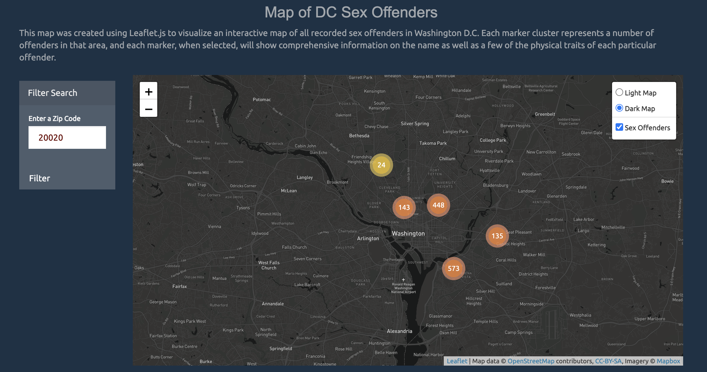
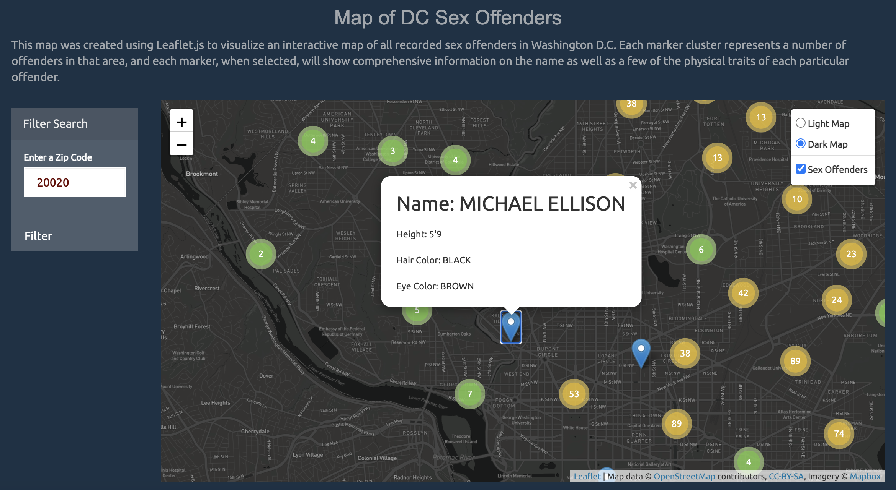

# UCI-Project-2

**Problem Statement:**
  One of the most interesting yet most obscure government health databases is the United States Department of Justice’s National Sex Offender Public Website. A list of offenders with past offenses, the purpose of the data source is to allow the public to protect themselves and their children. We will be utilizing a Kaggle dataset on all sex offenders that are registered within the Washington D.C. area that utilizes the DOJ’s National Sex Offender Public Website to create a more comprehensive data set with more metadata, including classification type and coordinates of their whereabouts. Our objective is to create a dynamic dashboard with a map showing coordinates of filtered offenders, a line chart with filtered dates of added offenders, and a filtered bar chart of the different offense types by ZIP Code. Ultimately, our dashboard’s aim is to create a more visually appealing and informative structure for providing protective information.
 
 First, we pulled data from a Kaggle dataset and cleaned up the data on a Jupyter notebook file to make visualization a smoother process down the road. We utilized Python and Pandas for data importing and cleaning, and used SQLAlchemy and PostGreSQL to export the then cleaned data into a cohesive database stored on our local host.
 
 Then, we utilized a Python Flask-powered API to pull the database from SQL and host this information on a local server. We also used this same application to house our future data visualizations on the same server. Once we were finished establishing our front-end code, we moved onto using Javascript and D3.js to house our back-end code for reading the data and creating three separate visualizations.
 
 We first used Leaflet.js to create an interactive map of all recorded sex offenders in Washington D.C. Each marker cluster represents a number of offenders in that area, and each marker, when selected, will show comprehensive information on the name as well as a few of the physical traits of each particular offender.

We utilized Javascript visualization library Chart.js for both the line and bar charts. The line chart represents all of the different years recorded in the dataset, and each point represents the number of offenders that were registered for that month. Clicking on a particular year on the legend removes or adds that year from the graph, allowing a more isolated visualization for a particular subset of years. When you hover over a set of points on the same x-axis, you’ll be given a list of all the offenders that were registered for that month across each year.

The final visualization is a bar chart separating the offenders on our list by their district of residence in D.C. and each offender's respective Maximum Classification for their offense(s). According to the Metropolitan Police Department, Class A offenders have been convicted of, or found not guilty by reason of insanity of a myriad of sexual offenses that can be found [here](https://mpdc.dc.gov/service/offender-classifications). Class B offenders have been convicted of, or found not guilty by reason of insanity to the same sexual offenses against a minor, or a person under the age of 18. When you hover over a bar from a specific district you’ll be given a list of offenders for both classifications that reside in that district. 

We also included a filter feature that would actively filter the data used for the three visualizations to dynamically update them by ZIP Code. When a DC ZIP Code is entered, a runFilter() function is fired off with an event listener, updating the map and graphs to only include individuals who reside in the chosen area.
 
Data Source: https://www.kaggle.com/karnikakapoor/sex-offender-registry
